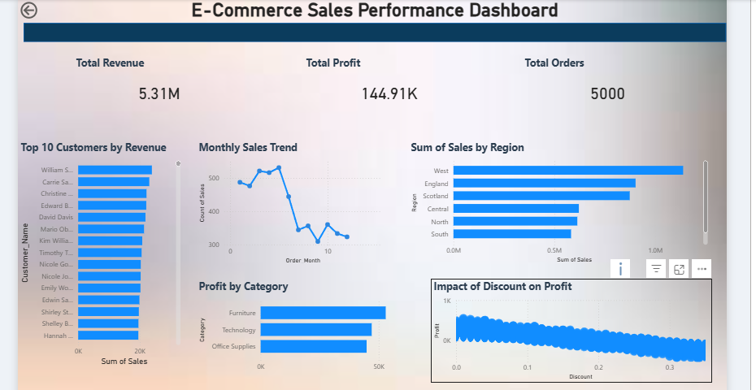

# 📊 E-Commerce Sales Performance Dashboard

## 🔍 Project Overview

This project analyzes e-commerce sales data to identify key business insights such as revenue trends, customer behavior, and profitability.

## 🛠 Tools Used

* Excel (Data Cleaning)
* MySQL (Data Analysis)
* Python (EDA)
* Power BI (Dashboard)

## 📈 Key Insights

* Sales show seasonal trends
* High discounts reduce profit
* Few customers generate majority revenue
* Some regions outperform others

## 📊 Dashboard Preview

## 📁 Files

* Dataset → data/
* SQL Queries → sql/
* Python Analysis → python/
* Power BI Dashboard → dashboard/

## 🚀 Author

Yash
